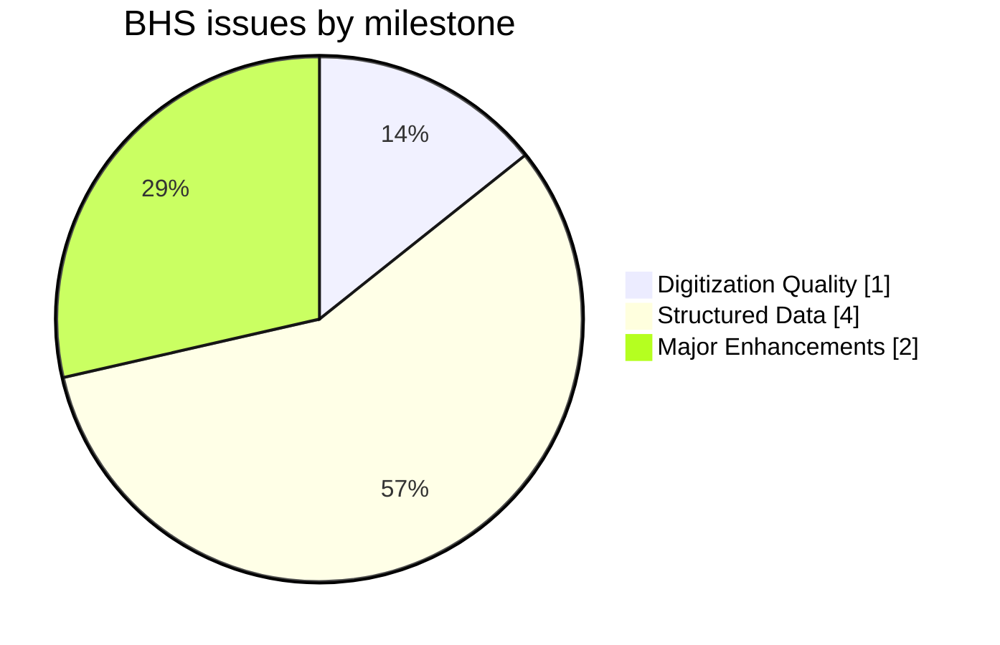
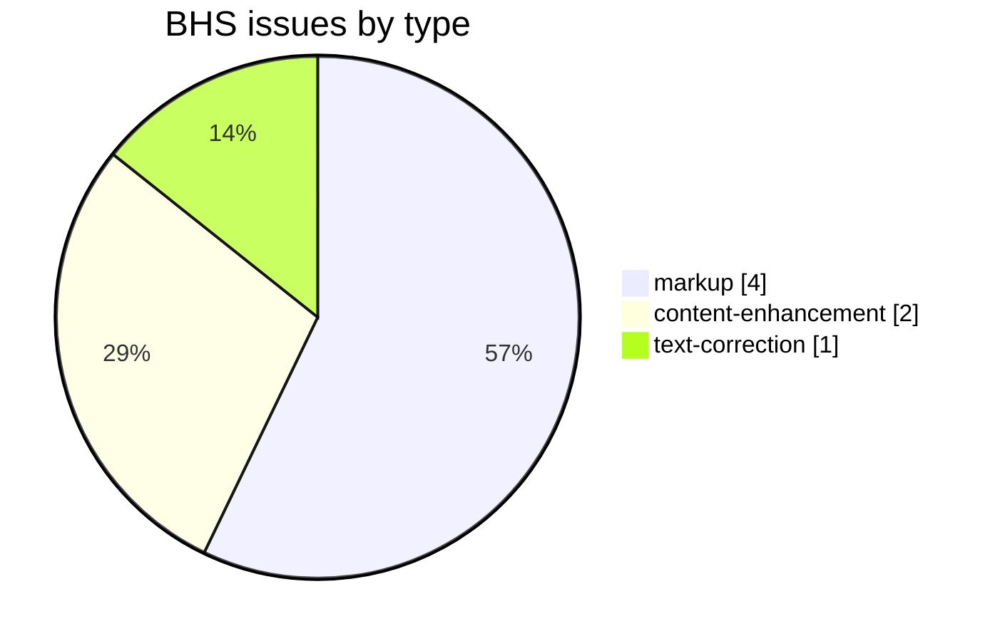
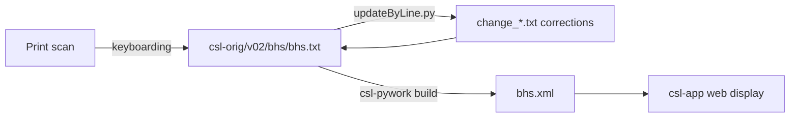

# BHS — Edgerton *Buddhist Hybrid Sanskrit Dictionary* (1953)

Development and correction repository for **Franklin Edgerton's *Buddhist Hybrid Sanskrit Grammar and Dictionary*, vol. 2 (Dictionary)**, a specialized dictionary of Buddhist Hybrid Sanskrit, part of the [Cologne Digital Sanskrit Lexicon](https://www.sanskrit-lexicon.uni-koeln.de/) (CDSL). The canonical source text lives in [`csl-orig/v02/bhs/bhs.txt`](https://github.com/sanskrit-lexicon/csl-orig/blob/master/v02/bhs/bhs.txt) (17,777 entries); this repository holds the development, correction, and enrichment work.

A specialized lexicon of the non-classical Sanskrit of Buddhist texts; entries carry multilingual notes (French, German).

## Documentation

- [docs/CORRECTION_MANUAL.md](https://github.com/sanskrit-lexicon/BHS/blob/main/docs/CORRECTION_MANUAL.md) — **operator manual**: the correction pipelines end-to-end (issue campaigns, English-error triage, headwords, meta2 loop), symptom→cure, maintainer appendix (metadoc: [docs/CORRECTION_MANUAL.meta.md](https://github.com/sanskrit-lexicon/BHS/blob/main/docs/CORRECTION_MANUAL.meta.md)).
- [CLAUDE.md](https://github.com/sanskrit-lexicon/BHS/blob/main/CLAUDE.md) — repository guide and data-format reference.
- [DATA_DICTIONARY.md](https://github.com/sanskrit-lexicon/BHS/blob/main/DATA_DICTIONARY.md) — markup tag reference.
- [CONTRIBUTING.md](https://github.com/sanskrit-lexicon/BHS/blob/main/CONTRIBUTING.md) · [CODE_OF_CONDUCT.md](https://github.com/sanskrit-lexicon/BHS/blob/main/CODE_OF_CONDUCT.md)

## Contents

| Path | Purpose |
|---|---|
| `eng_error_lang/` | `eng_error_lang/` working files |
| `headwordmod/` | `headwordmod/` working files |
| `issues/` | Per-issue working files |
| `meta/` | `meta/` working files |
| `prefaces/` | Front-matter OCR (title block, Preface, Bibliography) with EN + RU — see [Front matter](#front-matter-prefaces) |

## Front matter (`prefaces/`)

Faithful OCR + Russian translation of the dictionary's **front matter** (title block, Edgerton's Preface, and the Bibliography & Abbreviations) from the Cologne scans. Source language is **English**, so the base per-page `.md` is the English edition and each page also has a `.ru.md`.

- Cologne source: <https://sanskrit-lexicon.uni-koeln.de/scans/csldev/csldoc/build/dictionaries/prefaces/bhspref.html>
- Consolidated editions: [prefaces/bhspref_all.en.md](prefaces/bhspref_all.en.md) · [prefaces/bhspref_all.ru.md](prefaces/bhspref_all.ru.md)
- In-folder index: [prefaces/README.md](prefaces/README.md)
- **Status: complete** — all 15 pages transcribed and translated: title block (01–02, 12–15), Edgerton's Preface (03–05), and the full Bibliography & Abbreviations (06–11, including the general-abbreviation pages C → Z and the Symbols key).

<strong>OCR run notes (2026-06-23)</strong>

Produced by the `/cologne-preface-ocr` skill on the **main thread** (background OCR subagents reproducibly hit a spurious content-filter API error on this dictionary; the main thread is unaffected). Two-volume work: the prior partial numbered the Dictionary-volume title block as pages 03–05; this pass corrected the numbering to follow the Cologne toctree (Preface and Bibliography are pages 03–11; the Dictionary title block is 12–15). The Bibliography pages are dense two-column reference lists — the densest content in the set; pages 09–11 (general abbreviations C → Z plus the Symbols key) were transcribed column-by-column in a second pass, and page 15 is a blank final verso.

## Timeline

| Period | Activity |
|---|---|
| 2021 | Repository activity begins (first tracked issues) |
| 2023–2023 | Ongoing corrections, markup, and comparison work |
| 2026-05 | Issue taxonomy, citation metadata, documentation |
| 2026-06 | Front-matter OCR + EN/RU translation of the prefaces (`prefaces/`, complete — all 15 pages) |

## Projects & Milestones

| Milestone | Open | Closed | Total |
|---|---|---|---|
| Dictionary to Book | 0 | 0 | 0 |
| Digitization Quality | 0 | 1 | 1 |
| Structured Data | 2 | 2 | 4 |
| Major Enhancements | 2 | 0 | 2 |
| **Total** | **4** | **3** | **7** |

## Issues

### Open

| # | Title | Type | Severity | Milestone |
|---|---|---|---|---|
| 2 | Semantic line breaks | markup | minor | Structured Data |
| 4 | Tooltip revision | content-enhancement | medium | Major Enhancements |
| 5 | meta2 update | markup | minor | Structured Data |
| 7 | docs-pass: BHS documentation review | content-enhancement | medium | Major Enhancements |

### Solved

| # | Title | Type | Severity | Milestone |
|---|---|---|---|---|
| 1 | BHS issues- Andhrabharati | text-correction | minor | Digitization Quality |
| 3 | words in different languages | markup | minor | Structured Data |
| 6 | [markup] Minor bhs.txt Markup Oddities | markup | minor | Structured Data |

## Labels

### Type labels

| Label | Meaning |
|---|---|
| `link-target` | Click-throughs from `<ls>` abbreviations to scanned PDF pages |
| `link-splitting` | Splitting combined `SOURCE N,N` refs into per-page links |
| `markup` | Normalising XML tag content |
| `text-correction` | Corrections to English/Sanskrit definitions or headwords |
| `content-enhancement` | New material or structural additions beyond correction |
| `encoding` | SLP1/IAST transcoding, character normalisation |
| `scan-quality` | Replacing blurry/skewed/missing scan pages |
| `bug` | Broken links, XML errors, broken downloads |
| `question` | Scholarly questions requiring research |

### Severity labels

| Label | Meaning |
|---|---|
| `minor` | Targeted fix — a handful of lines or a single file |
| `medium` | Standard unit of work — one batch of corrections |
| `hard` | Large effort spanning many sources or files |

## Contributors

| Contributor | Commits |
|---|---|
| funderburkjim | 22 |
| gasyoun (Mārcis Gasūns) | 8 |
| drdhaval2785 | 3 |

## Source

- **Author**: Edgerton, Franklin
- **Title**: *Buddhist Hybrid Sanskrit Grammar and Dictionary*
- **Place / Publisher**: New Haven: Yale University Press
- **Year(s)**: 1953
- **Language pair**: Buddhist Hybrid Sanskrit → English
- **Size (CDSL headword index)**: 17,777 entries
- **License (digital edition)**: CC BY-SA 4.0
- See [CITATION.cff](CITATION.cff) for machine-readable citation.

## Encoding

- UTF-8 (NFC) throughout.
- Sanskrit text in SLP1 transliteration, wrapped in `{#…#}`; English gloss / italic display text in ``.
- Devanāgarī and IAST display forms are generated at display time, not stored in the source.

## How it works

---
*Issue taxonomy and documentation per the [Cologne issue runbook](https://github.com/sanskrit-lexicon/csl-observatory/blob/main/runbook/cologne-issue-runbook.md).*
