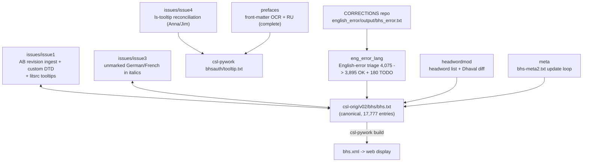

# BHS correction pipelines — operator manual

_Created: 11-07-2026 · Last updated: 11-07-2026_

This is the **operator manual** for the BHS repository: how corrections,
headword work, English-error triage, meta2 maintenance and the issue
campaigns for Edgerton's *Buddhist Hybrid Sanskrit Grammar and Dictionary*
(vol. II, 1953) actually run — end-to-end, without reading the source code
first.

Three documents describe this repo, with different jobs:

- **What the repo is** (timeline, issue typology, prefaces) —
  [README.md](https://github.com/sanskrit-lexicon/BHS/blob/main/README.md);
- **Code contract for AI/code sessions** (entry format with annotated
  example) — [CLAUDE.md](https://github.com/sanskrit-lexicon/BHS/blob/main/CLAUDE.md);
- **How to operate the pipelines** (this document) —
  [docs/CORRECTION_MANUAL.md](https://github.com/sanskrit-lexicon/BHS/blob/main/docs/CORRECTION_MANUAL.md).

Commands are quoted verbatim from the per-folder readmes
([eng_error_lang](https://github.com/sanskrit-lexicon/BHS/blob/main/eng_error_lang/readme.txt),
[meta](https://github.com/sanskrit-lexicon/BHS/blob/main/meta/readme.txt),
[headwordmod](https://github.com/sanskrit-lexicon/BHS/blob/main/headwordmod/hw1.sh),
issues 1/3/4); scripts and paths verified on disk 11-07-2026.

## The dictionary's special shape (read this first)

BHS is CDSL's most **multilingual** dictionary: Edgerton's entries gloss
Buddhist Hybrid Sanskrit against English *and* quote French, German,
Tibetan, Latin and Tocharian scholarship. Two consequences drive everything
here:

1. **Custom markup elements exist only for BHS** — issue1 added
   `<tib>`, `<ger>`, `<fr>`, `<acr>`, `<ed>`, `<ms>`, `<lat>`, `<toch>` to
   the display DTD (`one.dtd`). Any tooling that whitelists "standard CDSL
   tags" must be taught these first.
2. **English spell-checking drowns in false positives** — a flagged "error"
   is usually a French/German/Tibetan word in an italic span, which is why
   the [eng_error_lang](#walkthrough-2--english-error-triage-eng_error_lang)
   triage exists (and why its readme's verdict on naive SpellChecker
   language lists is: *"'porridge' is classified as both an English and
   French word. Yuk!"*).

The canonical text is
[csl-orig `v02/bhs/bhs.txt`](https://github.com/sanskrit-lexicon/csl-orig/blob/master/v02/bhs/bhs.txt)
(17,777 entries; SLP1 headwords in `<k1>`/`<k2>`, body text with `{@…@}`
lemma display, `` italics, `〔…〕` reference brackets — annotated first
entry in [CLAUDE.md § Data format](https://github.com/sanskrit-lexicon/BHS/blob/main/CLAUDE.md#data-format)).

## Cheat-sheet: the correction loop

The standard Cologne loop, with BHS names filled in:

```sh
# 0. Snapshot canonical text, pinned by commit (record the hash)
git -C <csl-orig> show <hash>:v02/bhs/bhs.txt > temp_bhs_0.txt

# 1. Build a change file — generated, or diffed from a hand-edited copy
python diff_to_changes_dict.py temp_bhs_0.txt temp_bhs_1_edited.txt change_1.txt

# 2. Apply (the universal transaction tool; NNN old / NNN new pairs, ; comments)
python updateByLine.py temp_bhs_0.txt change_1.txt temp_bhs_1.txt

# 3. Validate: copy into csl-orig, rebuild, XML-check — then restore if dev-only
cp temp_bhs_1.txt <csl-orig>/v02/bhs/bhs.txt
cd <csl-pywork>/v02 && sh generate_dict.sh bhs ../../bhs && sh xmlchk_xampp.sh bhs
# issue1-style local dev display instead: sh redo.sh 1  → dev1/web/, then
python <cologne>/xmlvalidate.py dev1/pywork/bhs.xml dev1/pywork/bhs.dtd

# 4. Deliver per the batched-PR rule — never push csl-orig directly
```

Delivery follows the org rule verbatim: prepare + validate locally, queue,
ship as **one consolidated batch PR** per the canonical
[correction workflow](https://github.com/sanskrit-lexicon/csl-corrections/blob/main/docs/correction-workflow.md).
The historical direct-commit blocks in the readmes (e.g.
[meta/readme.txt](https://github.com/sanskrit-lexicon/BHS/blob/main/meta/readme.txt)'s
sync-to-github section) are the upstream maintainers' pattern, not yours.

## Map of the workspaces



| Workspace | Status |
|---|---|
| [issues/issue1/](https://github.com/sanskrit-lexicon/BHS/tree/main/issues/issue1) — Andhrabharati's revised digitization ingested (452-change `change_1_ab.txt`, mostly `acr`→`ab`), the 8 custom DTD elements, `litsrc/` tooltip work, dev-display loop | done (2023) |
| [issues/issue3/](https://github.com/sanskrit-lexicon/BHS/tree/main/issues/issue3) — unmarked German/French inside italics: `check1..4` + Google-Translate-augmented wordlists → `change_1_ger.txt` … `change_4.txt` | done (2023) |
| [issues/issue4/](https://github.com/sanskrit-lexicon/BHS/tree/main/issues/issue4) — `<ls>` tooltip reconciliation against Anna Rybakova's list (`compare_tagcount_ls.py` loop, front-matter abbreviation extraction) | done (12-2024) |
| [eng_error_lang/](https://github.com/sanskrit-lexicon/BHS/tree/main/eng_error_lang) — the English-error triage | done; **180-case TODO残 open** |
| [headwordmod/](https://github.com/sanskrit-lexicon/BHS/tree/main/headwordmod) — headword normalization + upstream-diff record | done (historical) |
| [meta/](https://github.com/sanskrit-lexicon/BHS/tree/main/meta) — `bhs-meta2.txt` refresh recipe | **re-runnable maintenance** |
| [prefaces/](https://github.com/sanskrit-lexicon/BHS/tree/main/prefaces) — front-matter OCR + Russian translation, all 15 pages | complete; self-documented in [prefaces/README.md](https://github.com/sanskrit-lexicon/BHS/blob/main/prefaces/README.md) |

## Environment and prerequisites

- **Python 3**, stdlib only (the exploratory `bhs_french.py`/`bhs_german.py`
  used the `spellchecker` pip module — their own readme deems the results
  unhelpful; nothing live depends on it).
- **Git Bash / POSIX shell** for `redo.sh`/`hw1.sh` and `diff`-based steps.
- **Sibling checkouts:** [csl-orig](https://github.com/sanskrit-lexicon/csl-orig)
  (`v02/bhs/bhs.txt` + `bhs-meta2.txt`),
  [csl-pywork](https://github.com/sanskrit-lexicon/csl-pywork)
  (`generate_dict.sh`, `xmlchk_xampp.sh`, the `bhsauth/tooltip.txt`),
  [CORRECTIONS](https://github.com/sanskrit-lexicon/CORRECTIONS)
  (`english_error/output/bhs_error.txt`, the eng_error_lang input, pinned at
  commit `7b27d61e4d5`), `BHSScan/2020/` (scan images, Cologne server).
- Historical paths in the readmes use the XAMPP layout
  (`/c/xampp/htdocs/cologne/...`) — remap to your flat checkout; only the
  structure matters. `headwordmod/hw1.sh` additionally references a
  `../../Cologne_localcopy/bhs/bhsxml/` tree that is not part of this repo.
- All files UTF-8, **no BOM**.

## Walkthrough 1 — a correction campaign (the issue1 pattern)

[issues/issue1/](https://github.com/sanskrit-lexicon/BHS/tree/main/issues/issue1)
is the model for ingesting an external revision (here: Andhrabharati's
improved digitization):

1. **Two pinned baselines**: the external revision
   (`temp_bhs_ab_1_orig.txt`, from the issue's zip attachment) and the CDSL
   text (`temp_bhs_0.txt` = csl-orig `46008399…`).
2. **Hand-correct the external text** (`temp_bhs_ab_1.txt`), then *derive*
   the change file rather than writing it:
   `python diff_to_changes_dict.py temp_bhs_ab_1_orig.txt temp_bhs_ab_1.txt change_1_ab.txt`
   (12 changes at first — growing to 452 after the litsrc pass, mostly
   `acr` → `ab` retagging).
3. **Local dev display + validity**: `sh redo.sh 1` copies the candidate
   into csl-orig, builds `dev1/` (browsable at the local web root), and
   `xmlvalidate.py dev1/pywork/bhs.xml dev1/pywork/bhs.dtd` reports
   unparseable records (12 on the first AB run — that count is the work
   queue).
4. **DTD consequences**: BHS's multilingual tags required extending
   `one.dtd` with `tib/ger/fr/acr/ed/ms/lat/toch` — any new element you
   introduce needs the same registration or every entry using it fails
   xmlvalidate.
5. `compare/` and `litsrc/` subfolders hold the comparison studies and the
   `<ab>`/`<ls>`/`<lex>`/`<lang>` tooltip work; front-matter abbreviations
   come from `BHS.Grammar_Front.pages.txt`.

## Walkthrough 2 — English-error triage ([eng_error_lang/](https://github.com/sanskrit-lexicon/BHS/tree/main/eng_error_lang))

Input: the org-wide English spell-scan's BHS hits
(`bhs_error.txt` from the CORRECTIONS repo, 4,075 words). Goal: split real
typos from the multilingual false positives.

```sh
python bhsnumber.py bhs_error.txt bhs_errornum.txt     # add 4-digit sequence ids
python marksan.py bhs_errornum.txt bhs_errornum1.txt bhs_ok_san.txt   # iterate!
```

`marksan.py` classifies each word `OK` or `TODO` with a reason, using
(a) six hand-built word lists — English 180 / French 367 / German 102 /
misc 39 / Sanskrit-misc 351 / Tibetan 137 = 1,176 words — and (b) pattern
rules for the remaining 2,899. **It is run repeatedly**, refining lists and
patterns, until nothing lands in the unmarked residue file; the final
`bhs_ok_san.txt` splits into
[bhs_error_ok.txt](https://github.com/sanskrit-lexicon/BHS/blob/main/eng_error_lang/bhs_error_ok.txt)
(3,895) and
[bhs_error_todo.txt](https://github.com/sanskrit-lexicon/BHS/blob/main/eng_error_lang/bhs_error_todo.txt)
(**180 — the still-open human review queue**, originally for Sampada).
The sequence numbers exist precisely so scattered/re-sorted records can be
restored to original order.

The exploratory `bhs_french.py` / `bhs_german.py` / `bhslang.py` scripts
(italic-span word harvesters, Tibetan line dump) are kept for reference;
their own readme records why they were shelved.

## Walkthrough 3 — headwords ([headwordmod/](https://github.com/sanskrit-lexicon/BHS/tree/main/headwordmod))

```sh
python hw1.py bhshw0.txt bhshw1.txt bhshw1_note.txt
diff -U $(wc -l < bhshw1.txt) bhshw1.txt <Cologne_localcopy>/bhs/bhsxml/xml/bhshw1.txt \
  | grep '^-' | sed 's/^-//g' > dhavalmodification.txt
```

`hw1.py` normalizes the raw headword list (strip `a-, an-`-style prefix
hyphens, homonym annotations, case oddities);
[bhshw1_note.txt](https://github.com/sanskrit-lexicon/BHS/blob/main/headwordmod/bhshw1_note.txt)
logs every transformation with page-column + line ranges, and
`dhavalmodification.txt` records exactly how the result differs from the
upstream (Dhaval's) list — the diff is the deliverable, an audit record of
divergences, not a patch to apply blindly.

## Walkthrough 4 — meta2 maintenance ([meta/](https://github.com/sanskrit-lexicon/BHS/tree/main/meta), re-runnable)

The recipe for refreshing csl-orig's `bhs-meta2.txt` after text changes:

```sh
cp <csl-orig>/v02/bhs/bhs.txt temp_bhs.txt
cp <csl-orig>/v02/bhs/bhs-meta2.txt bhs-meta2.txt
python check_ea1.py temp_bhs.txt check_ea1.txt        # extended-ASCII census (75 codes)
python check_tags.py temp_bhs.txt check_tags.txt check_tags_local.txt   # tag census
# revise bhs-meta2.txt MANUALLY from the two censuses, then:
cp bhs-meta2.txt <csl-orig>/v02/bhs/
cd <csl-pywork>/v02 && sh generate_dict.sh bhs ../../bhs && sh xmlchk_xampp.sh bhs
# deliver per the batched-PR rule (the readme's direct-push block is the maintainers')
```

The statistics inform the human; nothing writes meta2 automatically.

## Walkthrough 5 — tooltip reconciliation (the issue4 pattern)

[issues/issue4/](https://github.com/sanskrit-lexicon/BHS/tree/main/issues/issue4)
reconciles the live `<ls>` tooltip list against an external reviewer's
(Anna Rybakova's) corrected list:

1. Pin baselines: `temp_bhs_0.txt` (csl-orig `bf5bfd16`), `temp_ls_0.txt`
   (csl-pywork `bhsauth/tooltip.txt`), Anna's `tagcount_ls_anna_10.12.24.txt`.
2. Jim's documented micro-edits to Anna's file first (a U+001E separator →
   space, an apostrophe fix, a `::`→`;;`) — every hand edit is itemised in
   the readme before any comparison runs.
3. `python compare_tagcount_ls.py tagcount_ls_0.txt tagcount_ls_anna_0.txt
   compare_tagcount_ls_0.txt` — iterate the compare/edit loop
   (`…_1`, `…_1a` generations, `…_diffs` outputs) until the two lists agree;
   `adjust_tooltip.py` + `extract_bhsfm_abbr.py`/`mark_lsfm.py` fold in
   front-matter abbreviations (`bhsfm_abbr.txt`).

## Symptom → cause → cure

| Symptom | Cause | Cure |
|---|---|---|
| `xmlvalidate.py` rejects records with `<ger>`/`<tib>`/`<fr>`/`<toch>`… | The custom BHS elements aren't in the DTD your build uses | They must be declared in `one.dtd` (issue1 added all 8); re-check after any csl-pywork refresh |
| English spell-scan "errors" that look fine | French/German/Tibetan/Latin words in italics — BHS's normal texture | That's what `marksan.py`'s lists+patterns absorb; add the word to the right `bhs_*_edit.txt` list, re-run, never "fix" the dictionary text |
| `updateByLine.py` old-text mismatch | Wrong pinned baseline (each issue folder records its csl-orig hash) | `git show <recorded-hash>:v02/bhs/bhs.txt` and regenerate the change file |
| `hw1.sh`'s diff step fails | It references a `Cologne_localcopy/bhs/bhsxml/` tree outside this repo | Provide a built `bhsxml` checkout at that relative location, or point the diff at your own copy |
| csl-orig dirty after a dev-display run | issue1's `redo.sh` copies the candidate into csl-orig to build `devN/` | `git -C <csl-orig> status` after every run; restore `bhs.txt` if the run was dev-only |
| A `naive` spellchecker language list misclassifies | Known dead end ("porridge is both English and French. Yuk!") | Use the curated `bhs_*_edit.txt` lists; the SpellChecker-derived lists are kept only as provenance |
| Invisible control characters break a tooltip compare | Anna's list contained U+001E separators (documented, 3 instances) | Scrub per issue4's edit-1 before comparing; check for non-printing bytes on any externally-contributed list |
| `check_ea1.py` output shifts unexpectedly | Extended-ASCII census reflects text changes upstream | Expected after corrections; that's the trigger to revise `bhs-meta2.txt` (walkthrough 4) |
| Change count differs from the readme's (12 vs 452) | `change_1_ab.txt` was regenerated after the litsrc pass — the readme records both generations | Trust the file in the tree; the readme narrates history, not final state |

## Glossary

| Term | Meaning here |
|---|---|
| BHS | Buddhist Hybrid Sanskrit — the non-classical language of Buddhist texts; also this repo/dictionary (Edgerton 1953, vol. II) |
| AB / Andhrabharati | the external reviser whose improved digitization issue1 ingested |
| custom elements | `<tib> <ger> <fr> <acr> <ed> <ms> <lat> <toch>` — BHS-only DTD additions for its multilingual quotations |
| `bhs_error_todo.txt` | the 180-case open human-review queue from the English-error triage |
| marksan lists | the six curated wordlists (`bhs_*_edit.txt`) that teach the triage which "errors" are really French/German/Tibetan/Sanskrit |
| meta2 | `bhs-meta2.txt` in csl-orig — display metadata revised by hand from the tag/extended-ASCII censuses |
| tagcount loop | issue4's iterative `compare_tagcount_ls.py` reconciliation of `<ls>` tooltip lists |
| `〔…〕` | BHS's reference-bracket convention in entry bodies (visible in the CLAUDE.md example) |
| dev display | issue1's `redo.sh N` local build (`devN/web/`) for eyeballing a candidate before delivery |
| batched-PR rule | corrections queue locally and ship as one consolidated csl-orig PR ~monthly — never direct pushes |

## Maintainer appendix

### Per-script breakdown

| Script | Dir | Role |
|---|---|---|
| `bhsnumber.py` / `marksan.py` | eng_error_lang | sequence-number the error list / classify OK-vs-TODO by lists + patterns (iterative) |
| `bhs_french.py`, `bhs_german.py`, `bhslang.py` | eng_error_lang | shelved exploratory harvesters (italic-span words; Tibetan lines) |
| `hw1.py` (+ `hw1.sh`) | headwordmod | headword normalization + upstream diff record |
| `check_ea1.py`, `check_tags.py` | meta | extended-ASCII and tag censuses feeding the manual meta2 revision |
| `diff_to_changes_dict.py`, `updateByLine.py` | issues/* (vendored per folder) | change-file derivation / application |
| `check1..4*.py`, `corr_to_change.py`, `change3.py` | issues/issue3 | unmarked-German/French detection + change-file build |
| `compare_tagcount_ls.py`, `adjust_tooltip.py`, `extract_bhsfm_abbr.py`, `mark_lsfm.py` | issues/issue4 | tooltip reconciliation loop + front-matter abbreviations |
| `build_combined.py` | prefaces | consolidated preface editions (`DICT=bhs python build_combined.py`) |

### Invariants

1. **Baselines are commit-pinned** — every issue folder records its csl-orig
   hash; change files are meaningless against any other snapshot.
2. **Change files are derived, not hand-written**, whenever a hand-edited
   copy exists (`diff_to_changes_dict.py`).
3. **Custom-element set is closed**: exactly the 8 issue1 elements; adding a
   ninth means a DTD change, a display change, and a note here.
4. **The triage's residue must reach zero** — `marksan.py` iterations end
   only when the unmarked file is empty; the TODO file is the human queue,
   not a dumping ground.
5. **Nothing writes meta2 or tooltips automatically** — censuses and compares
   inform documented manual edits.

### Known traps and observed defects

1. **CLAUDE.md's Architecture table is self-referential** ("`meta/` —
   `meta/` working files") — it names the folders without saying what they
   do; this manual's map supersedes it (fixing CLAUDE.md is metadoc backlog
   #3).
2. **`eng_error_lang/readme.txt` has a typo** in its final-count block
   (`bhs_error_todo.txxt`) and its two OK-counts disagree (3,793 vs 3,895 —
   the committed file's count is authoritative).
3. **The 180-case TODO queue is still open** — originally assigned to
   Sampada; nothing in the repo records progress since.
4. **`hw1.sh` depends on an out-of-repo `Cologne_localcopy` tree** — the one
   unfetchable dependency here.
5. **External review lists can carry invisible control characters**
   (issue4's three U+001E) — scrub before diffing.
6. **The local checkout may lack a `main` branch** — older clones sit on a
   stale `readme-refresh-h548` with a misconfigured upstream; `git switch -c
   main origin/main` fixes it (bit this manual's author on 11-07-2026).

Improvement backlog, provenance and revision history live in the companion
metadoc:
[docs/CORRECTION_MANUAL.meta.md](https://github.com/sanskrit-lexicon/BHS/blob/main/docs/CORRECTION_MANUAL.meta.md).

_Dr. Mārcis Gasūns_
